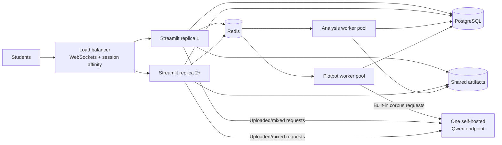

# Enterprise and Horizontal Deployment

This guide is for engineers deploying DocuScope CA at institutional or
classroom scale, beyond a single Docker host. If you just want to try the
application locally, see the [README](README.md#docker-deployment-recommended)
instead — none of this is required for local or desktop use.

It covers:

- the **Horizontal Deployment Contract** for running multiple Streamlit
  replicas behind a load balancer
- **network exposure** expectations for local and production hosts
- the optional **authorization bootstrap** for deployments that require login
- the optional **self-hosted Qwen3 Coder model** for AI-assisted Plotbot
- measured **concurrency and capacity** data from load testing

## Horizontal Deployment Contract

Use this sequence for a horizontally scaled institutional deployment:

1. **Deploy one self-hosted Qwen service.** Use Docker Model Runner and the
  pinned model in `docker-compose.model.yml`. Keep its OpenAI-compatible
  endpoint on the deployment's private network. One model instance is the
  starting point; it is not replicated with each app container.
2. **Configure the model connection once.** Set `DOCUSCOPE_AI_PROVIDER=local`,
  `DOCUSCOPE_AI_BASE_URL`, and `DOCUSCOPE_AI_MODEL` wherever the orchestrator
  supplies environment values to the Streamlit-app and Plotbot-worker
  containers (a `.env` file for Compose, or the equivalent secret/config
  mechanism elsewhere — see [Optional Local Qwen3 Coder
  Model](#optional-local-qwen3-coder-model) below for the exact variables).
  Every replica then inherits the same settings.
3. **Deploy multiple Streamlit replicas behind a load balancer.** The load
  balancer must support WebSockets and session affinity. Every app replica must
  use the same PostgreSQL service, Redis service, and shared artifact
  filesystem.
4. **Scale the worker pools separately.** Add `rq_worker` replicas for
  deterministic analysis load and `rq_plotbot_worker` replicas for Plotbot
  queue load. All Plotbot workers send requests to the same Qwen endpoint.



The production orchestrator may translate the Compose services into its native
service definitions; the checked-in Compose files remain the single-host
reference. No application-specific discovery mechanism is required. Preserve
these service invariants:

| Role | Replicas | Required connections or storage |
| --- | --- | --- |
| `migrate` | One job per release | PostgreSQL; must finish before app and workers start |
| `streamlit_app` | Two or more | PostgreSQL, Redis, and the shared artifact filesystem |
| `rq_worker` | One or more | PostgreSQL, Redis, and the same shared artifact filesystem |
| `rq_plotbot_worker` | One or more when Plotbot is enabled | PostgreSQL, Redis, and the shared model endpoint |
| `cleanup` | Exactly one | PostgreSQL and the shared artifact filesystem |
| Qwen/model service | Start with one | One stable OpenAI-compatible endpoint shared by every app and Plotbot worker |

Route users through a TLS-terminating load balancer with WebSocket support and
session affinity. Mount the same durable, POSIX-compatible storage at
`/app/webapp/_artifacts` in every app, deterministic worker, and cleanup
container. A local Docker named volume satisfies this only on one Docker host;
multi-host deployments need an external shared filesystem. PostgreSQL and Redis
must likewise be shared services, not one instance per app replica.

Horizontal application scaling does not require a model replica for every app
replica. Start with one self-hosted Qwen endpoint. The dedicated Plotbot queue
provides backpressure when a class submits requests together, so requests can
wait for the model instead of requiring paid API capacity or a GPU cluster.
Add model capacity only if the Plotbot benchmark and queue wait times on the
actual host show that one endpoint is insufficient.

When reproducing the Compose environment in an orchestrator, the required
application settings are deliberately small (the same topology as the table
above, expressed as environment variables):

| Containers | Settings |
| --- | --- |
| App and all workers | `DATABASE_URL`, `REDIS_URL`, `DOCUSCOPE_RQ_ENABLED=1` |
| App | `DOCUSCOPE_RQ_PLOTBOT_QUEUE=docuscope-plotbot` |
| Deterministic workers | `DOCUSCOPE_RQ_QUEUE=docuscope` |
| Plotbot workers | `DOCUSCOPE_RQ_QUEUE=docuscope-plotbot`, `DOCUSCOPE_RQ_PLOTBOT_QUEUE=docuscope-plotbot` |
| App and Plotbot workers, only when Plotbot is enabled | `DOCUSCOPE_AI_PROVIDER=local`, `DOCUSCOPE_AI_BASE_URL`, `DOCUSCOPE_AI_MODEL` |

`DOCUSCOPE_AI_BASE_URL` must be reachable from the containers and include the
provider's OpenAI-compatible `/v1` base path. `DOCUSCOPE_AI_MODEL` must exactly
match an ID returned by that endpoint's `/v1/models` response. Set
`DOCUSCOPE_AI_API_KEY` only when the private endpoint requires a bearer token;
the other queue, timeout, retry, and retention settings already have operational
defaults in the application and `docker-compose.yml`.

## Local and Production Network Exposure

The default Compose stack publishes only Streamlit on port `8501`. PostgreSQL,
Redis, and Docker Model Runner remain internal to the deployment. The
application, workers, migration, and cleanup services reach them over the
Compose network.

Local diagnostics or host-run PostgreSQL integration tests can opt into
loopback-only database and Redis ports:

```bash
docker compose -f docker-compose.yml -f docker-compose.dev.yml up -d
```

The development override binds PostgreSQL and Redis to `127.0.0.1`, not all
host interfaces. For a production deployment, omit that override, supply
generated `POSTGRES_DB`, `POSTGRES_USER`, and `POSTGRES_PASSWORD` values through
the deployment environment or secret manager, restrict host firewall rules,
and place Streamlit behind a TLS-terminating reverse proxy. Passwords containing
URL-reserved characters must be percent-encoded for the generated SQLAlchemy
connection URL.

> **Security policy**: enable application authentication only for deployments
> that require it, and never expose an unauthenticated model endpoint (Qwen or
> otherwise) to an untrusted network. The rest of this guide assumes both of
> those defaults unless a section says otherwise.

## Optional Authorization Bootstrap

Authentication and role-based authorization are deployment-specific and are
not required for normal local or desktop use. For a deployment where
authorization is enabled, set the optional first administrator in
`.streamlit/secrets.toml`:

```toml
[authorization]
bootstrap_admin_email = "operator@example.edu"
```

On startup, the application grants this address the `admin` role only when no
active administrator already exists. The address is normalized to lowercase,
and the database records the assignment with `added_by = "system"` and an
`added_at` timestamp. Leaving the field empty or omitting the section creates
the standard roles without automatically granting administrator access. The
secret is not read when authorization is disabled.

## Optional Local Qwen3 Coder Model

The normal DocuScope deployment is model-free. AI-assisted Plotbot can be added
with [Docker Model Runner](https://docs.docker.com/ai/model-runner/), using the
optional `docker-compose.model.yml` override. Compose pulls and configures
the repository's digest-pinned `ai/qwen3-coder` artifact, then injects its
OpenAI-compatible endpoint and model ID into only `streamlit_app` and
`rq_plotbot_worker`:

```bash
docker compose -f docker-compose.yml -f docker-compose.model.yml up -d --build
```

The first run downloads approximately 16.5 GiB of model data. Pull it before a
class or maintenance window instead of relying on a first student request. The
model remains in Docker Model Runner's local cache across ordinary Compose
restarts. Ordinary `docker compose up -d --build` does not pull or start it.

This is the intended Plotbot deployment when avoiding paid APIs and externally
managed model changes. It requires no OpenAI account or API key. Plotbot asks
the model for short plotting programs rather than general-purpose conversations,
and its dedicated Redis/RQ queue limits how many requests reach the shared model
at once. A medium or large institution does not need a dedicated GPU cluster to
try this architecture: begin with one model instance on the deployment host and
measure it under the expected classroom request pattern.

The model reference in `docker-compose.model.yml` is pinned to an immutable
content digest. Existing and fresh hosts therefore use the same approved model
artifact even if the registry's `latest` tag later changes. Treat a model update
like an application update: set `DOCUSCOPE_MODEL_RUNNER_MODEL` to the proposed
new reference, run the health check, smoke test, and benchmark below, and change
the checked-in digest only after those checks pass.

Docker Compose 2.38 or later and Docker Model Runner are required. On Docker
Desktop, enable Model Runner in **Settings > AI**. On Ubuntu or Debian Docker
Engine hosts, install and verify the plugin before starting the model override:

```bash
sudo apt-get update
sudo apt-get install docker-model-plugin
docker model version
```

The configured model uses a 4096-token context and Docker Model Runner's
portable `llama.cpp` backend. It can run on Apple Silicon, NVIDIA and AMD GPUs,
and CPU-only Linux. A GPU can improve latency but is not an architectural
requirement. Hardware compatibility does not by itself establish classroom
capacity, so use the included benchmark and queue wait times to decide whether
the initial host is sufficient.

Verify the model-aware deployment from a consumer container, then run the
functional Plotbot checks:

```bash
docker compose -f docker-compose.yml -f docker-compose.model.yml exec \
  rq_plotbot_worker python -c \
  'from webapp.utilities.ai.providers import check_openai_compatible_provider_health as check; print(check(timeout_seconds=10))'
docker compose -f docker-compose.yml -f docker-compose.model.yml run --rm \
  streamlit_app python -m webapp.utilities.ai.plotbot_smoke
docker compose -f docker-compose.yml -f docker-compose.model.yml run --rm \
  streamlit_app python -m webapp.utilities.ai.plotbot_benchmark
```

Override `DOCUSCOPE_MODEL_RUNNER_MODEL` only after qualifying the replacement
model against that benchmark. The model is intentionally not attached to the
deterministic analysis worker.

On a single Docker host, `docker-compose.model.yml` performs the model wiring
automatically; no AI environment variables or API key need to be supplied.

If the deployment places app containers on other hosts, do not add the
`-f docker-compose.model.yml` override there — that file provisions a
co-located model via Compose's `models:` block, which is only for the
single-host case. `docker-compose.yml` already declares
`DOCUSCOPE_AI_PROVIDER`, `DOCUSCOPE_AI_BASE_URL`, `DOCUSCOPE_AI_MODEL`, and
`DOCUSCOPE_AI_API_KEY` on both `streamlit_app` and `rq_plotbot_worker`, each
defaulting to empty (`${DOCUSCOPE_AI_PROVIDER:-}`). Set the values for the
external, private Qwen endpoint in a `.env` file next to `docker-compose.yml`
(already excluded from version control) rather than editing the tracked
Compose file:

```bash
# .env (not committed)
DOCUSCOPE_AI_PROVIDER=local
DOCUSCOPE_AI_BASE_URL=http://<private-qwen-host>/<openai-v1-path>
DOCUSCOPE_AI_MODEL=<model-id-returned-by-the-endpoint>
```

Compose reads `.env` from the working directory automatically, so
`docker compose -f docker-compose.yml up -d --build` (no model override)
picks up these values for every `streamlit_app` and `rq_plotbot_worker`
replica. An orchestrator that does not use Compose directly should inject the
same three variables through its own environment/secret mechanism instead.

From an app or Plotbot-worker container, a request to
`$DOCUSCOPE_AI_BASE_URL/models` must return the configured
`DOCUSCOPE_AI_MODEL` before Plotbot is enabled. This remains a self-hosted
deployment and does not require an external API. Leave `DOCUSCOPE_AI_API_KEY`
unset unless the institution protects that private endpoint with a bearer
token (see [Network Exposure](#local-and-production-network-exposure) above).

Do not start one model per Streamlit replica. Begin with one shared endpoint;
the dedicated `docuscope-plotbot` queue keeps model requests controlled and out
of the deterministic `docuscope` analysis queue. Model replication or a model
load balancer is an optional later optimization, not a prerequisite for
horizontal scaling of the application.

Plotbot routing also follows the data boundary. Requests based only on bundled
corpora run on `rq_plotbot_worker`. Requests involving uploaded or mixed corpus
data run in the user's Streamlit process and are not placed in Redis. Model
prompts contain the plotting request, dataframe schema and column names, and any
previous plotting code; corpus rows are not included. Generated code executes
against the dataframe inside DocuScope.

The benchmark exits nonzero if any generated plot fails its correctness checks.
Repeat it under expected concurrency and record p50/p95 latency before choosing
replica count or increasing model concurrency. Monitor model readiness,
request latency and waiting requests, GPU utilization/VRAM/OOMs,
the `docuscope-plotbot` queue depth and oldest-job age, Plotbot worker failures,
and container restarts. A model outage should alert on Plotbot capacity without
marking the core corpus-analysis application unhealthy.

**Data-loss caution**: `docker compose down -v` removes `postgres_data` and
`artifact_data`. Model Runner manages its model cache separately. Use plain
`docker compose down` unless a full application-data reset is intended.

## Enterprise Deployment Capacity

> This section applies to **enterprise mode** (`desktop_mode = false` in `webapp/config/options.toml`), which is the configuration used for the hosted web application and any institutional multi-user deployment. Desktop mode is a single-user variant with a simpler storage backend and different defaults; it is not addressed here.

### Concurrent Users

**Key takeaways:**

- *For instructors using the CMU-hosted deployment:* the strongest current classroom evidence is for built-in-corpus token-frequency work. In clean Docker testing, two `30`-student cohorts completed that workflow with zero failures or skipped virtual users. Instructors should still avoid scheduling unvalidated compute-heavy workflows, such as large custom-corpus processing or keyness generation, so that an entire class triggers the same expensive step at the exact same moment.
- *Desktop alternative:* for scenarios where concurrent workflows with many users is a priority, [the desktop version of the application](https://github.com/browndw/docuscope-ca-desktop) provides an alternative.
- *For institutions or engineers considering self-hosting:* a single-node deployment can support the representative built-in token-frequency classroom path, but horizontal scaling (multiple instances behind a load balancer) is still recommended for broader classroom or multi-user use.
- *For future development:* continue extending shared artifacts and queued execution to eligible deterministic built-in workflows, and add cohort-scale validation for compare/keyness paths that now use this architecture.

Providing a precise ceiling for concurrent users depends on the specific workflows in use. Browser-level load tests using Artillery and Playwright against the local enterprise-mode Docker deployment provide a measured baseline for the current build; these should be treated as single-node capacity observations rather than hard limits for a horizontally scaled deployment.

Streamlit uses a thread-per-session model (one thread per user session, one Python process per instance). DocuScope CA adds a CPU-intensive NLP pipeline (spaCy + DocuScope tagging, approximately 1.1 minutes per million words), so the practical ceiling is constrained by available CPU threads and RAM rather than by the framework itself. The startup-only result in the table below (270 sessions, zero failures) is consistent with [published single-page Streamlit benchmarks](https://karnwong.me/posts/2024/09/streamlit-load-test-performance/).

The following table summarizes the August 2026 clean-Docker validation runs. All measurements are from one local Docker Compose stack running one Streamlit app container with PostgreSQL, Redis, and an RQ worker.

| Scenario | Created / completed | Failed | Skipped | Session p95 / p99 | Outcome |
| --- | ---: | ---: | ---: | ---: | --- |
| Startup only | `270 / 270` | `0` | `0` | `1.15s / 1.27s` | Stable startup baseline |
| Internal target ready | `189 / 189` | `0` | `231` | `14.05s / 14.62s` | Built-in target load completed for all launched VUs |
| Token frequencies max30 | `123 / 123` | `0` | `417` | `46.64s / 47.59s` | All launched token-frequency workflows completed |
| Token frequencies max60 retry | `144 / 144` | `0` | `936` | `97.77s / 99.74s` | Local stress run completed all launched workflows; many arrivals skipped by the local browser generator |
| Token frequencies classroom | `60 / 60` | `0` | `0` | `42.21s / 43.93s` | Two `30`-student cohorts completed the built-in token-frequency workflow |

In the classroom-shaped token-frequency run, the internal target-load step measured `1.22s / 1.47s` at p95 / p99 and frequency-table generation measured `0.36s / 0.84s` at p95 / p99, apart from intentional classroom think time. In the open-arrival max60 retry, the high skipped count reflects local Artillery/Playwright generator backpressure: the local runner could not launch every scheduled browser workflow at the requested rate. It is not the same as app-side workflow failure, but it does mean the result should not be presented as proof of full deployed 60-user open-arrival capacity.

For those running their own load tests, the scenarios under `load_tests/scenarios/` provide reproducible baselines for startup, built-in corpus readiness, token-frequency stress tests, and classroom-shaped token-frequency workflows.

### Per-User Data Limits

The following limits apply to each user session in enterprise mode:

| Resource | Limit | Configuration key |
| --- | --- | --- |
| Maximum corpus text size (raw input) | 20 MB | `max_text_size` |
| Maximum tokenized DataFrame size | 150 MB | `max_polars_size` |
| File upload size (Streamlit widget) | 200 MB per file | Streamlit server default |
| Session inactivity timeout | 90 minutes | `inactivity_timeout_minutes` |
| Absolute session duration | 24 hours | `absolute_timeout_hours` |
| AI-assisted analysis quota (optional) | 200 requests per user | `quota` |

The 20 MB raw-text limit is sufficient for a corpus of 3 million words (several hundred typical academic documents); most teaching or specialized corpora will fall well within it. Note that Streamlit's file picker will accept uploads up to 200 MB, but the application enforces its own 20 MB ceiling during ingestion. A user who uploads a large file will receive an error after upload but before processing begins — instructors should be aware of this sequence when setting expectations for students.

Session data persists for up to 24 hours. Users receive a warning at 85 minutes of inactivity and at 23.5 hours of total session age before automatic logout.

The limits above are **application-level controls** that apply in any enterprise deployment regardless of host infrastructure. For the hosted instance at Carnegie Mellon University, storage and bandwidth are governed by Campus Cloud VM configuration. No hard quotas are imposed at the infrastructure level under normal research and teaching usage; if a deployment were to generate unusually high resource consumption, Campus Cloud administrators would make contact before taking any action.

### Overload and Traffic Management

Protection against overload operates at three distinct layers, which are important to distinguish:

#### Core Corpus Processing

- Per-corpus data limits (described above) prevent any single session from consuming disproportionate memory or processing time.
- PostgreSQL-backed session persistence, shared built-in artifact reuse, queued RQ execution, and lazy generation of derived tables reduce repeated I/O and keep expensive deterministic work out of Streamlit session threads.

In educational settings, instructors commonly work with the pre-processed corpora bundled with the application. Because these corpora are already tokenized and annotated, they can be loaded without running the full NLP pipeline, which substantially reduces per-user compute load and makes simultaneous classroom use more practical.

The analysis workflow where concurrent load is most visible is **keyness calculation** (the Compare Corpora tool, Page 5). Deterministic comparisons between bundled corpora use public shared artifacts and Redis/RQ: concurrent requests converge on one control-plane reservation, and later sessions attach the ready result instead of recomputing it. Comparisons involving uploaded or mixed uploaded/built-in corpora remain session-local and are never written to the shared artifact registry. For corpora larger than 1.5 million tokens, the interface also disables the most stringent p-value option (`p < .001`) to reduce per-query memory risk. Cohort-scale load validation for keyness remains a follow-up even though cross-session reuse is implemented.

#### AI-Assisted Analysis Features

The AI-assisted Plotbot page is **optional** and is not required for any core
corpus-analysis workflow. It can use a community OpenAI key, the optional local
Qwen3 Coder deployment, or another OpenAI-compatible institutional endpoint.
Community-key requests have application rate limits; local or institutional
capacity is bounded by the configured model service and dedicated Plotbot queue.

Because classroom deployments may share a single community API key across many simultaneous users, that route has its own protection layer: a daily per-user quota on community-key usage, a cap on simultaneous requests (5 on a community key), a circuit breaker that pauses traffic after repeated API failures, and request deduplication to avoid redundant API calls for similar prompts. The enterprise configuration also defines additional request-per-minute and queue-size settings that can be tuned for a deployment, though the concurrency cap and circuit-breaker behavior are the clearest protections enforced in the current implementation.

All of these settings are configurable in the `[llm.enterprise]` section of `webapp/config/options.toml` and can be tuned to match the API tier and expected user load of a given deployment. Administrators who need to adjust individual thresholds — for example, for a large lecture course sharing a community key — will find the full parameter reference there.

#### Infrastructure-Level Protection

The outermost safety net for the CMU-hosted instance is the Campus Cloud infrastructure itself. The underlying VMs are configured with OS-level controls that provide a fair share of memory, disk, and CPU to each process. Under sustained extreme load, Campus Cloud infrastructure can intervene to protect shared resources. This layer operates independently of the application and requires no configuration within DocuScope CA.

---

For further context on Streamlit's scaling characteristics and approaches to increasing concurrency, the following resources are useful:

- [Streamlit load test performance](https://karnwong.me/posts/2024/09/streamlit-load-test-performance/) — load test benchmarking Streamlit at scale
- [Streamlit at Scale: Why My App Froze with 100 Users](https://medium.com/@hadiyolworld007/streamlit-at-scale-why-my-app-froze-with-100-users-666e736fcff0) — practical discussion of Streamlit's concurrency model and its limitations
- [Streamlit single concurrency control](https://www.whitphx.info/posts/20240227-streamlit-single-concurrency-control/) — approach for controlling per-session concurrency
- [Scaling Streamlit](https://ploomber.io/blog/scaling-streamlit/) — strategies for scaling Streamlit applications to higher traffic
