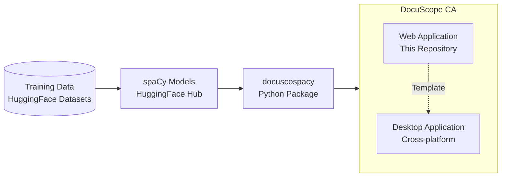

# DocuScope Corpus Analysis & Concordancer

<div class="image" align="center">
    
    <br>
</div>

---

[![License][license]](https://github.com/browndw/docuscope-ca-online/blob/main/LICENSE) [![Python][python]](https://www.python.org/downloads/) [![Streamlit][streamlit]](https://streamlit.io) [![spaCy][spacy]](https://spacy.io) [![Tests][tests]](https://github.com/browndw/docuscope-ca-online/actions/workflows/test.yml) [![DOI][doi]](https://doi.org/10.5281/zenodo.17392153)

## DocuScope Ecosystem

The DocuScope ecosystem comprises several interconnected components designed to facilitate corpus analysis and rhetorical tagging.



## DocuScope and Part-of-Speech tagging with spaCy

This application is designed for the analysis of corpora assisted by integrated part-of-speech and DocuScope rhetorical tagging.

With the application users can:

1. process corpora
2. create frequency tables of words, phrases, and tags
3. calculate associations around node words
4. generate key word in context (KWIC) tables
5. compare corpora or sub-corpora
6. explore single texts
7. practice advanced plotting

## Why DocuScope CA?

Existing corpus analysis tools force researchers to choose between accessibility and analytical depth. Popular tools like AntConc excel at concordancing and frequency analysis but lack linguistic annotation. Web platforms like Voyant Tools offer accessible visualization but no rhetorical analysis. Code-centric frameworks provide sophisticated processing but require substantial programming expertise.

DocuScope CA uniquely combines:

- **Educational Accessibility**: Intuitive web interface requiring no programming knowledge
- **Analytical Depth**: Integrated linguistic (spaCy) and rhetorical (DocuScope) annotation
- **Reproducible Workflows**: Headless API/CLI with provenance tracking
- **Flexible Deployment**: Desktop, web, container, and hosted options
- **Research-Ready**: Built for both exploratory discovery and hypothesis-driven studies

## Installation and Usage

DocuScope CA offers multiple deployment options to accommodate different user preferences and technical requirements.

### Live Web Application (Immediate Access)

For immediate access without any installation, DocuScope CA is freely available as a hosted web application:

- **Access**: [DocuScope CA Enterprise](https://docuscope-ca.eberly.cmu.edu/)
- **Features**: Full enterprise functionality including user management and session persistence
- **Requirements**: Modern web browser only

### Docker Deployment (Recommended)

The simplest way to run DocuScope CA locally is using Docker:

```bash
# Clone the repository
git clone https://github.com/browndw/docuscope-ca-online.git
cd docuscope-ca-online

# Launch the application
docker-compose up
```

The application will be available at `http://localhost:8501`. Docker automatically handles all dependencies, Python environment setup, and package installations.

### Local Installation

For users preferring local installation:

```bash
# Clone the repository
git clone https://github.com/browndw/docuscope-ca-online.git
cd docuscope-ca-online

# Create and activate a Python virtual environment (Python 3.11)
python3.11 -m venv venv
source venv/bin/activate  # On Windows: venv\Scripts\activate

# Install dependencies (models are bundled in `webapp/_models/`)
pip install -r requirements.txt

# Launch the application
streamlit run webapp/index.py
```

> *Review note*: The tested pipelines, CLI/API workflows, and the JOSS reproduction script run entirely offline; no OpenAI credentials or external network access are required unless you opt into the AI-assisted features documented later in the README.

#### Notes

- The project targets Python 3.11 exclusively; other versions are not supported.
- The DocuScope-enhanced spaCy models ship with the repository under `webapp/_models/`, so no additional downloads are required for local use.

### Desktop Application

Pre-built installers are available for all major platforms:

- **Download**: [DocuScope CA Desktop](https://github.com/browndw/docuscope-ca-desktop)
- **Platforms**: macOS (Apple Silicon & Intel), Windows, and Linux

### Automated Testing

To install the extra test dependencies and run the automated test suite from the project root:

```bash
python -m pip install -e ".[test]"
pytest -q
```

When working inside a conda environment, ensure that the `pytest` command resolves to the interpreter that has the project dependencies installed. In particular, some conda builds of `polars` require CPU extensions (AVX/AVX2, FMA, BMI1, BMI2, LZCNT, MOVBE); if you encounter runtime messages about missing CPU features, invoke pytest via the environment-specific interpreter, for example:

```bash
/path/to/miniconda3/envs/myenv/bin/python -m pytest -q
```

This avoids pulling in a different interpreter that was built with incompatible `polars` binaries.

> *Continuous integration note*: the GitHub Actions workflow (`.github/workflows/test.yml`) runs the full battery of linting, unit, integration, performance, UI, and Docker checks on release tags (`v*.*.*`) or when manually dispatched. Between releases the same commands can be executed locally using the snippets above.

### Reproducible Example Workflow

Reviewers can regenerate the artifacts referenced in the JOSS paper using the bundled headless script:

```bash
python paper/scripts/run_example.py
```

The script uses the sample corpus under `paper/data/test_corpus/`, runs the DocuScope + spaCy pipeline, and writes deterministic Parquet tables plus a provenance `manifest.json` to `paper/data/example_output/`. It makes no network calls and can be executed inside the Docker container or a local environment prepared with `pip install -e .`.

## Using as Template

This repository can be used as a template for creating custom deployments:

- **Desktop Version**: Use the "Use this template" button to create a desktop application
- **Custom Deployments**: Adapt for institutional or research-specific needs
- **Educational Versions**: Create modified versions for classroom use

## Features

This application provides a comprehensive suite of tools for corpus analysis, built on the broader DocuScope ecosystem:

- **Corpus Processing**: Upload and process small to medium-sized text corpora
- **Dual Tagging**: Combines part-of-speech tagging with DocuScope rhetorical analysis via the `docuscospacy` package
- **Ecosystem Integration**: Pre-trained models distributed via HuggingFace Hub with transparent provenance
- **Frequency Analysis**: Generate detailed frequency tables for words, phrases, and rhetorical tags
- **Collocation Analysis**: Calculate statistical associations around target words
- **KWIC Tables**: Create keyword-in-context concordances for detailed text examination
- **Comparative Analysis**: Compare different corpora or sub-sections of the same corpus
- **Single Document Explorer**: In-depth analysis of individual texts
- **Advanced Visualization**: Interactive plotting tools for data exploration
- **Dual Mode Operation**:
  - **Enterprise Mode**: Full-featured deployment for institutional use
  - **Desktop Mode**: Streamlined interface for individual researchers
- **Reproducible Workflows**: Provenance manifests with version tracking and content hashes

## Configuration

The application behavior is controlled through the `webapp/config/options.toml` file. Key configuration options include:

- `desktop_mode`: Enables/disables simplified interface (default: `false`)
- Language validation settings
- File size limits
- AI integration controls
- Database logging options

Refer to the configuration files in `webapp/config/` for detailed customization options.

## Usage Examples

### Educational Workflow (No Programming Required)

Perfect for students and novice researchers:

1. **Select or Upload Corpus**: Choose from built-in sample corpora or upload custom text collections
2. **Automatic Processing**: The integrated spaCy+DocuScope pipeline generates token-level linguistic and rhetorical annotations
3. **Explore Results**: Use the intuitive interface to explore frequency distributions, rhetorical patterns, and linguistic features
4. **Create Visualizations**: Generate charts and export results for further analysis
5. **Maintain Provenance**: All processing steps are tracked with version and model information

### Basic Corpus Analysis

1. Load your corpus using the "Manage Corpora" page
2. Generate frequency tables for initial exploration
3. Use KWIC tables to examine specific terms in context
4. Create visualizations to identify patterns

### Comparative Studies

1. Upload multiple corpora or define sub-corpora
2. Use "Compare Corpora" tools to identify statistical differences
3. Generate comparative visualizations
4. Export results for further analysis

## Headless API & CLI

A thin, stable headless interface is provided for reproducible, non-interactive workflows.

Python API example:

```python
from docuscope_ca import process_corpus

result = process_corpus(
    sources="paper/data/test_corpus",   # dir, file, list, or list of raw texts
    model="en_docusco_spacy",
    metrics=("freq", "tags", "dtm"),   # choose subset
    export_dir="out"                    # optional parquet + manifest.json
)
print(result.manifest["corpus"]["total_tokens"], "tokens")
```

CLI (installed as console script):

```bash
docuscope-ca process \
  --input paper/data/test_corpus \
  --metrics freq,tags,dtm \
  --out out_dir \
  --manifest
```

Exit codes: 0 success; 2 corpus load error; 3 model load error; 4 processing error; 5 export error.

Generated artifacts (when export enabled)

- tokens.parquet
- frequency_pos.parquet, frequency_ds.parquet
- tags_pos.parquet, tags_ds.parquet
- dtm_pos.parquet, dtm_ds.parquet (if requested)
- manifest.json (version, model, metrics, per-document hashes)

The manifest enables deterministic regeneration and peer review verification.

## Citation

If you use this software, please cite the software itself (and the JOSS article once published). Citation metadata is maintained in `CITATION.cff` (Github renders a "Cite this repository" button).

**Software citation (provisional):**

```bibtex
@software{docuscope_ca_2025,
  title        = {DocuScope Corpus Analysis & Concordancer},
  author       = {Brown, David West},
  year         = {2025},
  version      = {0.4.0},
  url          = {https://github.com/browndw/docuscope-ca-online},
  note         = {Apache-2.0 license. Add JOSS and Zenodo DOIs when available.}
}
```

After JOSS acceptance, update this section to include the article DOI (dual citation of article + software where venue policies permit).

## Enterprise Deployment Capacity

> This section applies to **enterprise mode** (`desktop_mode = false` in `webapp/config/options.toml`), which is the configuration used for the hosted web application and any institutional multi-user deployment. Desktop mode is a single-user variant with a simpler storage backend and different defaults; it is not addressed here.

### Concurrent Users

**Key takeaways:**

- *For instructors using the CMU-hosted deployment:* the hosted instance is horizontally scaled, but on any single node approximately 15 users running the same compute-heavy workflow simultaneously can produce lag and dropped sessions. In practice this means instructors should avoid scheduling scenarios where an entire class executes the same analysis step at the same moment.
- *Desktop alternative:* for scenarios where concurrent workflows with many users is a priority, [the desktop version of the application](https://github.com/browndw/docuscope-ca-desktop) provides an alternative.
- *For institutions or engineers considering self-hosting:* a single-node deployment is sufficient for small or asynchronous use, but horizontal scaling (multiple instances behind a load balancer) is strongly recommended for any classroom or multi-user context.
- *For future development:* improving load management for simultaneous identical processes — particularly keyness generation — is a priority.

Providing a precise ceiling for concurrent users depends on the specific workflows in use. Browser-level load tests using Arsenal and Playwright against the local enterprise-mode deployment provide a measured baseline for the current build; these should be treated as single-node capacity observations rather than hard limits for a horizontally scaled deployment.

Streamlit uses a thread-per-session model (one thread per user session, one Python process per instance). DocuScope CA adds a CPU-intensive NLP pipeline (spaCy + DocuScope tagging, approximately 1.1 minutes per million words), so the practical ceiling is constrained by available CPU threads and RAM rather than by the framework itself. The startup-only result in the table below (270 sessions, zero failures) is consistent with [published single-page Streamlit benchmarks](https://karnwong.me/posts/2024/09/streamlit-load-test-performance/).

The following table summarizes results from these load tests. All measurements are from a single VM running one application instance.

| Scenario | Max VUs | Sessions (created / completed) | Outcome |
|---|---|---|---|
| Application startup only | 270 | 270 / 270 | Stable — zero failures |
| Keyness, internal corpora (ramp-up profile) | 14 | — | Stable — zero failures (heavy skipping) |
| Keyness, internal corpora (ramp-up profile) | 15 | — | Transition zone — intermittent failures |
| Keyness, internal corpora (ramp-up profile) | 16 | — | Fails reliably |
| Compare-ready workflow (ramp-up profile) | 15 | 53 / 52 | Near-stable — 1 failure at final keyness/render step |
| Token-frequency, preprocessed corpora | 15–30 | — | Rendering timeouts under sustained load |
| Keyness, arrival-count profile | 15 | 15 / 15 | Stable — zero failures (recommended profile) |

For those running their own load tests, the arrival-count-based scenario in `load_tests/scenarios/keyness-internal.yml` provides a reproducible single-node baseline.

### Per-User Data Limits

The following limits apply to each user session in enterprise mode:

| Resource | Limit | Configuration key |
|---|---|---|
| Maximum corpus text size (raw input) | 20 MB | `max_text_size` |
| Maximum tokenized DataFrame size | 150 MB | `max_polars_size` |
| File upload size (Streamlit widget) | 200 MB per file | Streamlit server default |
| Session inactivity timeout | 90 minutes | `inactivity_timeout_minutes` |
| Absolute session duration | 24 hours | `absolute_timeout_hours` |
| AI-assisted analysis quota (optional) | 200 requests per user | `quota` |

The 20 MB raw-text limit is sufficient for a corpus of 3 million words (several hundred typical academic documents); most teaching or specialized corpora will fall well within it. Note that Streamlit's file picker will accept uploads up to 200 MB, but the application enforces its own 20 MB ceiling during ingestion. A user who uploads a large file will receive an error after upload but before processing begins — instructors should be aware of this sequence when setting expectations for students.

Session data persists for up to 24 hours. Users receive a warning at 85 minutes of inactivity and at 23.5 hours of total session age before automatic logout.

The limits above are **application-level controls** that apply in any enterprise deployment regardless of host infrastructure. For the hosted instance at Carnegie Mellon University, storage and bandwidth are governed by Campus Cloud VM configuration. No hard quotas are imposed at the infrastructure level under normal research and teaching usage; if a deployment were to generate unusually high resource consumption, Campus Cloud administrators would make contact before taking any action.

### Overload and Traffic Management

Protection against overload operates at three distinct layers, which are important to distinguish:

**Core corpus processing (all users)**

- Per-corpus data limits (described above) prevent any single session from consuming disproportionate memory or processing time.
- Session persistence, sharded SQLite storage, and lazy generation of derived tables reduce repeated I/O and help keep multi-user access responsive.

In educational settings, instructors commonly work with the pre-processed corpora bundled with the application. Because these corpora are already tokenized and annotated, they can be loaded without running the full NLP pipeline, which substantially reduces per-user compute load and makes simultaneous classroom use more practical.

The analysis workflow where concurrent load is most visible is **keyness calculation** (the Compare Corpora tool, Page 5). Keyness tables are cached in user-scoped session memory but are not shared across users; cross-session caching has been considered but is architecturally non-trivial given the user-scoped storage model. For corpora larger than 1.5 million tokens, the interface also disables the most stringent p-value option (`p < .001`) to reduce per-query memory risk. Optimizing repeated keyness generation across sessions is a target for future improvement.

**AI-assisted analysis features (optional, Pages 11 and 12 only)**

The AI-assisted analysis pages use an OpenAI API key and are **optional** — they are not required for any of the core corpus analysis workflows. The key point for instructors is that **the optional AI features have rate limits; the core analysis tools do not**.

Because classroom deployments may share a single community API key across many simultaneous users, these pages have their own protection layer: a daily per-user quota on community-key usage, a cap on simultaneous requests (5 on a community key), a circuit breaker that pauses traffic after repeated API failures, and request deduplication to avoid redundant API calls for similar prompts. The enterprise configuration also defines additional request-per-minute and queue-size settings that can be tuned for a deployment, though the concurrency cap and circuit-breaker behavior are the clearest protections enforced in the current implementation.

All of these settings are configurable in the `[llm.enterprise]` section of `webapp/config/options.toml` and can be tuned to match the API tier and expected user load of a given deployment. Administrators who need to adjust individual thresholds — for example, for a large lecture course sharing a community key — will find the full parameter reference there.

**Infrastructure-level protection (hosted deployment only)**

The outermost safety net for the CMU-hosted instance is the Campus Cloud infrastructure itself. The underlying VMs are configured with OS-level controls that provide a fair share of memory, disk, and CPU to each process. Under sustained extreme load, Campus Cloud infrastructure can intervene to protect shared resources. This layer operates independently of the application and requires no configuration within DocuScope CA.

---

For further context on Streamlit's scaling characteristics and approaches to increasing concurrency, the following resources are useful:
- [Streamlit load test performance](https://karnwong.me/posts/2024/09/streamlit-load-test-performance/) — load test benchmarking Streamlit at scale
- [Streamlit at Scale: Why My App Froze with 100 Users](https://medium.com/@hadiyolworld007/streamlit-at-scale-why-my-app-froze-with-100-users-666e736fcff0) — practical discussion of Streamlit's concurrency model and its limitations
- [Streamlit single concurrency control](https://www.whitphx.info/posts/20240227-streamlit-single-concurrency-control/) — approach for controlling per-session concurrency
- [Scaling Streamlit](https://ploomber.io/blog/scaling-streamlit/) — strategies for scaling Streamlit applications to higher traffic

## License

Code licensed under [Apache License 2.0](https://www.apache.org/licenses/LICENSE-2.0).
See [LICENSE](https://github.com/browndw/docuscope-ca-online/blob/main/LICENSE) file.

## Contributing

We welcome contributions! Please see our contributing guidelines for:

- Code style requirements
- Testing procedures
- Pull request process
- Issue reporting

## Acknowledgments

- **DocuScope**: This project builds upon the DocuScope rhetorical analysis framework developed at Carnegie Mellon University
- **spaCy**: Natural language processing capabilities provided by the spaCy library
- **Streamlit**: Web application framework enabling accessible deployment

## Support and Documentation

For comprehensive guides and tutorials:

- **Documentation**: [DocuScope CA Documentation](https://browndw.github.io/docuscope-docs/)

For questions, bug reports, or feature requests:

- Open an issue on [GitHub Issues](https://github.com/browndw/docuscope-ca-online/issues)

> [!IMPORTANT]
> Features like `desktop_mode` can be activated/deactivated from the `options.toml` file. Their defaults are set at their most restrictive.

---

[license]: https://img.shields.io/github/license/browndw/docuscope-ca-online
[python]: https://img.shields.io/badge/python-3.11-blue
[streamlit]: https://static.streamlit.io/badges/streamlit_badge_black_white.svg
[spacy]: https://img.shields.io/badge/made%20with%20❤%20and-spaCy-09a3d5.svg
[tests]: https://github.com/browndw/docuscope-ca-online/actions/workflows/test.yml/badge.svg
[doi]: https://zenodo.org/badge/DOI/10.5281/zenodo.17392153.svg
