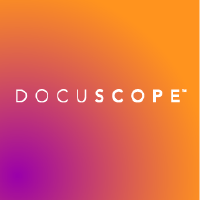
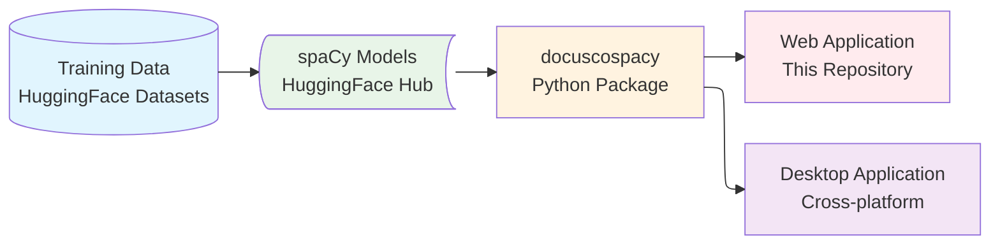

# DocuScope Corpus Analysis & Concordancer

<div class="image" align="center">
    
    <br>
</div>

---

[![License][license]](https://github.com/browndw/docuscope-ca-online/blob/main/LICENSE) [![Python][python]](https://www.python.org/downloads/) [![Streamlit][streamlit]](https://streamlit.io) [![spaCy][spacy]](https://spacy.io) [![Tests][tests]](https://github.com/browndw/docuscope-ca-online/actions/workflows/test.yml)

## DocuScope Ecosystem

The DocuScope ecosystem comprises several interconnected components designed to facilitate corpus analysis and rhetorical tagging.



## DocuScope and Part-of-Speech tagging with spaCy

This application is designed for the analysis of corpora assisted by integrated part-of-speech and DocuScope rhetorical tagging.

With the application users can:

1. process corpora
2. create frequency tables of words, phrases, and tags
3. calculate associations around node words
4. generate key word in context (KWIC) tables
5. compare corpora or sub-corpora
6. explore single texts
7. practice advanced plotting

## Why DocuScope CA?

Existing corpus analysis tools force researchers to choose between accessibility and analytical depth. Popular tools like AntConc excel at concordancing and frequency analysis but lack linguistic annotation. Web platforms like Voyant Tools offer accessible visualization but no rhetorical analysis. Code-centric frameworks provide sophisticated processing but require substantial programming expertise.

DocuScope CA uniquely combines:

- **Educational Accessibility**: Intuitive web interface requiring no programming knowledge
- **Analytical Depth**: Integrated linguistic (spaCy) and rhetorical (DocuScope) annotation
- **Reproducible Workflows**: Headless API/CLI with provenance tracking
- **Flexible Deployment**: Desktop, web, container, and hosted options
- **Research-Ready**: Built for both exploratory discovery and hypothesis-driven studies

## Installation and Usage

DocuScope CA offers multiple deployment options to accommodate different user preferences and technical requirements.

### Live Web Application (Immediate Access)

For immediate access without any installation, DocuScope CA is freely available as a hosted web application:

- **Access**: [DocuScope CA Enterprise](https://docuscope-ca.eberly.cmu.edu/)
- **Features**: Full enterprise functionality including user management and session persistence
- **Requirements**: Modern web browser only

### Docker Deployment (Recommended)

The simplest way to run DocuScope CA locally is using Docker:

```bash
# Clone the repository
git clone https://github.com/browndw/docuscope-ca-online.git
cd docuscope-ca-online

# Launch the application
docker-compose up
```

The application will be available at `http://localhost:8501`. Docker automatically handles all dependencies, Python environment setup, and package installations.

### Local Installation

For users preferring local installation:

```bash
# Clone the repository
git clone https://github.com/browndw/docuscope-ca-online.git
cd docuscope-ca-online

# Create and activate a Python virtual environment
python -m venv venv
source venv/bin/activate  # On Windows: venv\Scripts\activate

# Install dependencies
pip install -r requirements.txt

# Launch the application
streamlit run webapp/index.py
```

**Note**: Ensure that the `streamlit` command uses the same Python environment where dependencies were installed.

### Desktop Application

Pre-built installers are available for all major platforms:

- **Download**: [DocuScope CA Desktop](https://github.com/browndw/docuscope-ca-desktop)
- **Platforms**: macOS (Apple Silicon & Intel), Windows, and Linux

### Requirements

- Python 3.11 (for local installation)
- Docker and Docker Compose (for Docker deployment)
- Modern web browser for accessing the application

## Documentation

Comprehensive documentation including installation guides, feature tutorials, and API references is available at [DocuScope CA Documentation](https://browndw.github.io/docuscope-docs/).

## Using as Template

This repository can be used as a template for creating custom deployments:

- **Desktop Version**: Use the "Use this template" button to create a desktop application
- **Custom Deployments**: Adapt for institutional or research-specific needs  
- **Educational Versions**: Create modified versions for classroom use

## Features

This application provides a comprehensive suite of tools for corpus analysis, built on the broader DocuScope ecosystem:

- **Corpus Processing**: Upload and process small to medium-sized text corpora
- **Dual Tagging**: Combines part-of-speech tagging with DocuScope rhetorical analysis via the `docuscospacy` package
- **Ecosystem Integration**: Pre-trained models distributed via HuggingFace Hub with transparent provenance
- **Frequency Analysis**: Generate detailed frequency tables for words, phrases, and rhetorical tags
- **Collocation Analysis**: Calculate statistical associations around target words
- **KWIC Tables**: Create keyword-in-context concordances for detailed text examination
- **Comparative Analysis**: Compare different corpora or sub-sections of the same corpus
- **Single Document Explorer**: In-depth analysis of individual texts
- **Advanced Visualization**: Interactive plotting tools for data exploration
- **Dual Mode Operation**:
  - **Enterprise Mode**: Full-featured deployment for institutional use
  - **Desktop Mode**: Streamlined interface for individual researchers
- **Reproducible Workflows**: Provenance manifests with version tracking and content hashes

## Configuration

The application behavior is controlled through the `webapp/config/options.toml` file. Key configuration options include:

- `desktop_mode`: Enables/disables simplified interface (default: `false`)
- Language validation settings
- File size limits
- AI integration controls
- Database logging options

Refer to the configuration files in `webapp/config/` for detailed customization options.

## Usage Examples

### Educational Workflow (No Programming Required)

Perfect for students and novice researchers:

1. **Select or Upload Corpus**: Choose from built-in sample corpora or upload custom text collections
2. **Automatic Processing**: The integrated spaCy+DocuScope pipeline generates token-level linguistic and rhetorical annotations
3. **Explore Results**: Use the intuitive interface to explore frequency distributions, rhetorical patterns, and linguistic features
4. **Create Visualizations**: Generate charts and export results for further analysis
5. **Maintain Provenance**: All processing steps are tracked with version and model information

### Basic Corpus Analysis

1. Load your corpus using the "Manage Corpora" page
2. Generate frequency tables for initial exploration
3. Use KWIC tables to examine specific terms in context
4. Create visualizations to identify patterns

### Comparative Studies

1. Upload multiple corpora or define sub-corpora
2. Use "Compare Corpora" tools to identify statistical differences
3. Generate comparative visualizations
4. Export results for further analysis

## Headless API & CLI

A thin, stable headless interface is provided for reproducible, non-interactive workflows.

Python API example:

```python
from docuscope_ca import process_corpus

result = process_corpus(
    sources="paper/data/test_corpus",   # dir, file, list, or list of raw texts
    model="en_docusco_spacy",
    metrics=("freq", "tags", "dtm"),   # choose subset
    export_dir="out"                    # optional parquet + manifest.json
)
print(result.manifest["corpus"]["total_tokens"], "tokens")
```

CLI (installed as console script):

```bash
docuscope-ca process \
  --input paper/data/test_corpus \
  --metrics freq,tags,dtm \
  --out out_dir \
  --manifest
```

Exit codes: 0 success; 2 corpus load error; 3 model load error; 4 processing error; 5 export error.

Generated artifacts (when export enabled)

- tokens.parquet
- frequency_pos.parquet, frequency_ds.parquet
- tags_pos.parquet, tags_ds.parquet
- dtm_pos.parquet, dtm_ds.parquet (if requested)
- manifest.json (version, model, metrics, per-document hashes)

The manifest enables deterministic regeneration and peer review verification.

## License

Code licensed under `Apache License 2.0 <https://www.apache.org/licenses/LICENSE-2.0>`_.
See `LICENSE <https://github.com/browndw/docuscope-ca-online/blob/main/LICENSE>`_ file.

## Contributing

We welcome contributions! Please see our contributing guidelines for:

- Code style requirements
- Testing procedures
- Pull request process
- Issue reporting

## Citation

If you use this software, please cite the software itself (and the JOSS article once published). Citation metadata is maintained in `CITATION.cff` (Github renders a "Cite this repository" button).

**Software citation (provisional):**

```bibtex
@software{docuscope_ca_2025,
  title        = {DocuScope Corpus Analysis & Concordancer},
  author       = {Brown, David West},
  year         = {2025},
  version      = {0.4.0},
  url          = {https://github.com/browndw/docuscope-ca-online},
  note         = {Apache-2.0 license. Add JOSS and Zenodo DOIs when available.}
}
```

After JOSS acceptance, update this section to include the article DOI (dual citation of article + software where venue policies permit).

## Acknowledgments

- **DocuScope**: This project builds upon the DocuScope rhetorical analysis framework developed at Carnegie Mellon University
- **spaCy**: Natural language processing capabilities provided by the spaCy library
- **Streamlit**: Web application framework enabling accessible deployment

## Support and Documentation

For comprehensive guides and tutorials:

- **Documentation**: [DocuScope CA Documentation](https://browndw.github.io/docuscope-docs/)

For questions, bug reports, or feature requests:

- Open an issue on [GitHub Issues](https://github.com/browndw/docuscope-ca-online/issues)

> [!IMPORTANT]
> Features like `desktop_mode` can be activated/deactivated from the `options.toml` file. Their defaults are set at their most restrictive.

---

[license]: https://img.shields.io/github/license/browndw/docuscope-ca-online
[python]: https://img.shields.io/badge/python-3.11%2B-blue
[streamlit]: https://static.streamlit.io/badges/streamlit_badge_black_white.svg
[spacy]: https://img.shields.io/badge/made%20with%20❤%20and-spaCy-09a3d5.svg
[tests]: https://github.com/browndw/docuscope-ca-online/actions/workflows/test.yml/badge.svg
