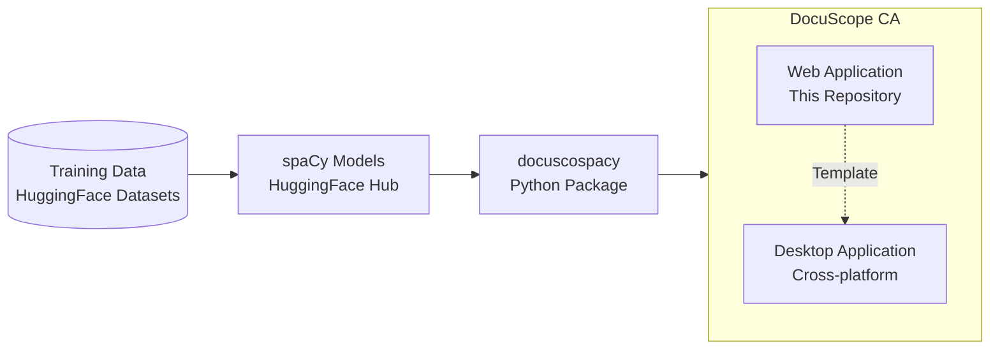

# DocuScope Corpus Analysis & Concordancer


---

[![License][license]](https://github.com/browndw/docuscope-ca-online/blob/main/LICENSE) [![Python][python]](https://www.python.org/downloads/) [![Streamlit][streamlit]](https://streamlit.io) [![spaCy][spacy]](https://spacy.io) [![Tests][tests]](https://github.com/browndw/docuscope-ca-online/actions/workflows/test.yml) [![JOSS][joss]]](https://joss.theoj.org/papers/10.21105/joss.10418)

## DocuScope Ecosystem

The DocuScope ecosystem comprises several interconnected components designed to facilitate corpus analysis and rhetorical tagging.



## DocuScope and Part-of-Speech tagging with spaCy

This application is designed for the analysis of corpora assisted by integrated part-of-speech and DocuScope rhetorical tagging.

With the application users can:

1. process corpora
2. create frequency tables of words, phrases, and tags
3. calculate associations around node words
4. generate key word in context (KWIC) tables
5. compare corpora or sub-corpora
6. explore single texts
7. practice advanced plotting

## Why DocuScope CA?

Existing corpus analysis tools force researchers to choose between accessibility and analytical depth. Popular tools like AntConc excel at concordancing and frequency analysis but lack linguistic annotation. Web platforms like Voyant Tools offer accessible visualization but no rhetorical analysis. Code-centric frameworks provide sophisticated processing but require substantial programming expertise.

DocuScope CA uniquely combines:

- **Educational Accessibility**: Intuitive web interface requiring no programming knowledge
- **Analytical Depth**: Integrated linguistic (spaCy) and rhetorical (DocuScope) annotation
- **Reproducible Workflows**: Headless API/CLI with provenance tracking
- **Flexible Deployment**: Desktop, web, container, and hosted options
- **Research-Ready**: Built for both exploratory discovery and hypothesis-driven studies

## Quick Start

Pick the path that fits:

- **Try it now, no install**: [DocuScope CA Enterprise](https://docuscope-ca.eberly.cmu.edu/) — hosted, browser only.
- **Docker (recommended)**:

  ```bash
  git clone https://github.com/browndw/docuscope-ca-online.git
  cd docuscope-ca-online
  docker compose up
  ```

  Open `http://localhost:8501`. See [Docker Deployment](#docker-deployment-recommended)
  for the full service list and rebuild instructions.
- **Local Python (no Docker)**:

  ```bash
  git clone https://github.com/browndw/docuscope-ca-online.git
  cd docuscope-ca-online
  python3.13 -m venv venv && source venv/bin/activate
  pip install -r requirements.txt
  streamlit run webapp/index.py
  ```

  See [Local Installation](#local-installation) for supported Python versions
  and the automatic Desktop Mode fallback.

Deploying for a classroom or institution beyond one host? See
[Enterprise and Horizontal Deployment](#enterprise-and-horizontal-deployment).

## Table of Contents

- [Quick Start](#quick-start)
- [Installation and Usage](#installation-and-usage)
  - [Live Web Application](#live-web-application-immediate-access)
  - [Docker Deployment](#docker-deployment-recommended)
  - [Local Installation](#local-installation)
  - [Desktop Application](#desktop-application)
  - [Automated Testing](#automated-testing)
  - [Reproducible Example Workflow](#reproducible-example-workflow)
- [Enterprise and Horizontal Deployment](#enterprise-and-horizontal-deployment)
- [Features](#features)
- [Configuration](#configuration)
- [Usage Examples](#usage-examples)
- [Headless API & CLI](#headless-api--cli)
- [Citation](#citation)
- [License](#license)
- [Using as Template](#using-as-template)
- [Contributing](#contributing)
- [Acknowledgments](#acknowledgments)
- [Support and Documentation](#support-and-documentation)

## Installation and Usage

DocuScope CA offers multiple deployment options to accommodate different user preferences and technical requirements.

### Live Web Application (Immediate Access)

For immediate access without any installation, DocuScope CA is freely available as a hosted web application:

- **Access**: [DocuScope CA Enterprise](https://docuscope-ca.eberly.cmu.edu/)
- **Features**: Full enterprise functionality including user management and session persistence
- **Requirements**: Modern web browser only

### Docker Deployment (Recommended)

The simplest way to run DocuScope CA locally is using Docker:

```bash
# Clone the repository
git clone https://github.com/browndw/docuscope-ca-online.git
cd docuscope-ca-online

# Launch the application
docker compose up
```

This starts the full enterprise-mode stack defined in `docker-compose.yml`:

- `postgres` — the SQLAlchemy-backed control plane (artifact/job registry, authorization, runtime config)
- `redis` — backs the RQ job queue
- `migrate` — applies pending Alembic control-plane migrations before application processes start
- `cleanup` — prunes expired sessions, temporary artifacts, terminal jobs, and old audit rows on an hourly schedule
- `streamlit_app` — the web application, available at `http://localhost:8501`
- `rq_worker` — processes deterministic analysis jobs (built-in target preparation, keyness, collocations, n-grams)
- `rq_plotbot_worker` — processes built-in-only Plotbot requests on an independently scalable queue

Docker automatically handles all dependencies, Python environment setup, and package installations.

For deployment handoff, choose one of these two commands and leave the remaining
application settings at their checked-in defaults:

```bash
# Core corpus-analysis application (Plotbot remains optional)
docker compose up -d --build

# Core application plus the repository-defined, self-hosted Qwen3 Coder model
docker compose -f docker-compose.yml -f docker-compose.model.yml up -d --build
```

The self-hosted model requires Docker Compose 2.38+ and Docker Model Runner,
and its first run downloads roughly 16.5 GiB of model data — see
[Optional Local Qwen3 Coder Model](ENTERPRISE_DEPLOYMENT.md#optional-local-qwen3-coder-model)
for prerequisites, benchmarking, and monitoring, whether running on one host or many.

The base Compose file is the canonical **single-host** reference topology. It
publishes one Streamlit container on host port `8501` and uses a Docker named
volume for shared artifacts. It can scale the two worker pools on that host, for
example:

```bash
docker compose up -d --scale rq_worker=2 --scale rq_plotbot_worker=2
```

Do not use `--scale streamlit_app=...` with the checked-in Compose file: each
replica would try to claim host port `8501`. More than one Streamlit replica,
multi-host deployment, and the optional self-hosted Plotbot model are covered
in [Enterprise and Horizontal Deployment](#enterprise-and-horizontal-deployment).

#### Rebuilding After Code Changes

`docker compose up` reuses previously built images if they already exist. After pulling new code (or making local changes), rebuild a clean image so the containers run the current code:

```bash
# Rebuild the migration, cleanup, app, and worker images with no layer cache
docker compose build --no-cache migrate cleanup streamlit_app rq_worker rq_plotbot_worker

# Recreate the full stack from the fresh images
docker compose up -d postgres redis migrate cleanup streamlit_app rq_worker rq_plotbot_worker

# Confirm migration completed and the four long-running services report healthy
docker compose ps
```

The cleanup service preserves public built-in artifacts unless an administrator
assigns an explicit `expires_at` value. New private compatibility artifacts
expire after 24 hours by default. Preview or run a cleanup pass manually with:

```bash
docker compose run --rm cleanup python -m webapp.persistence.cleanup --once --dry-run
docker compose run --rm cleanup python -m webapp.persistence.cleanup --once
```

To validate that Postgres, Redis, and the RQ worker are wired together correctly on a fresh build, run the bundled smoke test, which enqueues a job through the running `streamlit_app` container and confirms the `rq_worker` processes it:

```bash
scripts/compose-rq-smoke.sh
```

### Local Installation

For users preferring local installation:

```bash
# Clone the repository
git clone https://github.com/browndw/docuscope-ca-online.git
cd docuscope-ca-online

# Create and activate a Python virtual environment (Python 3.11, 3.12, or 3.13)
python3.13 -m venv venv
source venv/bin/activate  # On Windows: venv\Scripts\activate

# Install dependencies (models are bundled in `webapp/_models/`)
pip install -r requirements.txt

# Launch the application
streamlit run webapp/index.py
```

*Review note*: The tested pipelines, CLI/API workflows, and the JOSS reproduction script run entirely offline; no OpenAI credentials or external network access are required unless you opt into the AI-assisted features documented later in the README.

> [!IMPORTANT]
> The shipped `webapp/config/options.toml` has `desktop_mode = false`, which is
> the enterprise/Postgres-backed setting used by Docker and hosted deployments.
> When `streamlit run webapp/index.py` is launched directly and the default local
> Postgres endpoint is unavailable, the app automatically falls back once to
> Desktop Mode with in-memory session storage. The terminal reports the fallback;
> session data lasts only for that app process. Use the
> [Docker Deployment](#docker-deployment-recommended) for durable Postgres/Redis
> services. Operators intentionally running enterprise services on localhost can
> set `DOCUSCOPE_DISABLE_DESKTOP_FALLBACK=1` to keep startup fail-fast.

#### Notes

- The project targets Python 3.11, 3.12, and 3.13.
- The DocuScope-enhanced spaCy models ship with the repository under `webapp/_models/`, so no additional downloads are required for local use.

### Desktop Application

Pre-built installers are available for all major platforms:

- **Download**: [DocuScope CA Desktop](https://github.com/browndw/docuscope-ca-desktop)
- **Platforms**: macOS (Apple Silicon & Intel), Windows, and Linux

### Automated Testing

To install the extra test dependencies and run the automated test suite from the project root:

```bash
python -m pip install -e ".[test]"
pytest -q
```

When working inside a conda environment, ensure that the `pytest` command resolves to the interpreter that has the project dependencies installed. In particular, some conda builds of `polars` require CPU extensions (AVX/AVX2, FMA, BMI1, BMI2, LZCNT, MOVBE); if you encounter runtime messages about missing CPU features, invoke pytest via the environment-specific interpreter, for example:

```bash
/path/to/miniconda3/envs/myenv/bin/python -m pytest -q
```

This avoids pulling in a different interpreter that was built with incompatible `polars` binaries.

> *Continuous integration note*: the GitHub Actions workflow (`.github/workflows/test.yml`) runs the full battery of linting, unit, integration, performance, UI, and Docker checks on release tags (`v*.*.*`) or when manually dispatched. Between releases the same commands can be executed locally using the snippets above.

### Reproducible Example Workflow

Reviewers can regenerate the artifacts referenced in the JOSS paper using the bundled headless script:

```bash
python paper/scripts/run_example.py
```

The script uses the sample corpus under `paper/data/test_corpus/`, runs the DocuScope + spaCy pipeline, and writes deterministic Parquet tables plus a provenance `manifest.json` to `paper/data/example_output/`. It makes no network calls and can be executed inside the Docker container or a local environment prepared with `pip install -e .`.

## Enterprise and Horizontal Deployment

> This section is for engineers deploying DocuScope CA at institutional or
> classroom scale, beyond a single Docker host. If you just want to try the
> app locally, the sections above are all you need.

The full guide, in [ENTERPRISE_DEPLOYMENT.md](ENTERPRISE_DEPLOYMENT.md), covers:

- **Horizontal Deployment Contract** — the required sequence and service
  invariants for running multiple Streamlit replicas behind a load balancer,
  with shared PostgreSQL, Redis, and artifact storage.
- **Network Exposure** — which services are safe to expose, TLS/reverse-proxy
  expectations, and production credential handling.
- **Optional Authorization Bootstrap** — enabling role-based authentication
  and the first administrator account for deployments that require it.
- **Optional Local Qwen3 Coder Model** — self-hosting the Plotbot AI model
  with Docker Model Runner, qualification benchmarks, and monitoring.
- **Enterprise Deployment Capacity** — measured concurrent-user load test
  results, per-user data limits, and overload/traffic-management layers.

## Features

This application provides a comprehensive suite of tools for corpus analysis, built on the broader DocuScope ecosystem:

- **Corpus Processing**: Upload and process small to medium-sized text corpora
- **Dual Tagging**: Combines part-of-speech tagging with DocuScope rhetorical analysis via the `docuscospacy` package
- **Ecosystem Integration**: Pre-trained models distributed via HuggingFace Hub with transparent provenance
- **Frequency Analysis**: Generate detailed frequency tables for words, phrases, and rhetorical tags
- **Collocation Analysis**: Calculate statistical associations around target words
- **KWIC Tables**: Create keyword-in-context concordances for detailed text examination
- **Comparative Analysis**: Compare different corpora or sub-sections of the same corpus
- **Single Document Explorer**: In-depth analysis of individual texts
- **Advanced Visualization**: Interactive plotting tools for data exploration
- **Dual Mode Operation**:
  - **Enterprise Mode**: Full-featured deployment for institutional use
  - **Desktop Mode**: Streamlined interface for individual researchers
- **Reproducible Workflows**: Provenance manifests with version tracking and content hashes

## Configuration

The application behavior is controlled through the `webapp/config/options.toml` file. Key configuration options include:

- `desktop_mode`: Enables/disables simplified interface (default: `false`)
- Language validation settings
- File size limits
- AI integration controls
- Database logging options

Refer to the configuration files in `webapp/config/` for detailed customization options.

## Usage Examples

### Educational Workflow (No Programming Required)

Perfect for students and novice researchers:

1. **Select or Upload Corpus**: Choose from built-in sample corpora or upload custom text collections
2. **Automatic Processing**: The integrated spaCy+DocuScope pipeline generates token-level linguistic and rhetorical annotations
3. **Explore Results**: Use the intuitive interface to explore frequency distributions, rhetorical patterns, and linguistic features
4. **Create Visualizations**: Generate charts and export results for further analysis
5. **Maintain Provenance**: All processing steps are tracked with version and model information

### Basic Corpus Analysis

1. Load your corpus using the "Manage Corpora" page
2. Generate frequency tables for initial exploration
3. Use KWIC tables to examine specific terms in context
4. Create visualizations to identify patterns

### Comparative Studies

1. Upload multiple corpora or define sub-corpora
2. Use "Compare Corpora" tools to identify statistical differences
3. Generate comparative visualizations
4. Export results for further analysis

## Headless API & CLI

A thin, stable headless interface is provided for reproducible, non-interactive workflows.

Python API example:

```python
from docuscope_ca import process_corpus

result = process_corpus(
    sources="paper/data/test_corpus",   # dir, file, list, or list of raw texts
    model="en_docusco_spacy",
    metrics=("freq", "tags", "dtm"),   # choose subset
    export_dir="out"                    # optional parquet + manifest.json
)
print(result.manifest["corpus"]["total_tokens"], "tokens")
```

CLI (installed as console script):

```bash
docuscope-ca process \
  --input paper/data/test_corpus \
  --metrics freq,tags,dtm \
  --out out_dir \
  --manifest
```

Exit codes: 0 success; 2 corpus load error; 3 model load error; 4 processing error; 5 export error.

Generated artifacts (when export enabled)

- tokens.parquet
- frequency_pos.parquet, frequency_ds.parquet
- tags_pos.parquet, tags_ds.parquet
- dtm_pos.parquet, dtm_ds.parquet (if requested)
- manifest.json (version, model, metrics, per-document hashes)

The manifest enables deterministic regeneration and peer review verification.

## Citation

If you use this software, please cite the software itself (and the JOSS article once published). Citation metadata is maintained in `CITATION.cff` (Github renders a "Cite this repository" button).

**Software citation (provisional):**

```bibtex
@software{docuscope_ca_2025,
  title        = {DocuScope Corpus Analysis & Concordancer},
  author       = {Brown, David West},
  year         = {2026},
  version      = {0.5.0},
  url          = {https://github.com/browndw/docuscope-ca-online},
  doi          = {10.5281/zenodo.17392153},
  note         = {Apache-2.0 license. Add the JOSS DOI after article acceptance.}
}
```

After JOSS acceptance, update this section to include the article DOI (dual citation of article + software where venue policies permit).

## License

Code licensed under [Apache License 2.0](https://www.apache.org/licenses/LICENSE-2.0).
See [LICENSE](https://github.com/browndw/docuscope-ca-online/blob/main/LICENSE) file.

## Using as Template

This repository can be used as a template for creating custom deployments:

- **Desktop Version**: Use the "Use this template" button to create a desktop application
- **Custom Deployments**: Adapt for institutional or research-specific needs
- **Educational Versions**: Create modified versions for classroom use

## Contributing

We welcome contributions! Please see our contributing guidelines for:

- Code style requirements
- Testing procedures
- Pull request process
- Issue reporting

## Acknowledgments

- **DocuScope**: This project builds upon the DocuScope rhetorical analysis framework developed at Carnegie Mellon University
- **spaCy**: Natural language processing capabilities provided by the spaCy library
- **Streamlit**: Web application framework enabling accessible deployment

## Support and Documentation

For comprehensive guides and tutorials:

- **Documentation**: [DocuScope CA Documentation](https://browndw.github.io/docuscope-docs/)

For questions, bug reports, or feature requests:

- Open an issue on [GitHub Issues](https://github.com/browndw/docuscope-ca-online/issues)

> [!IMPORTANT]
> Features like `desktop_mode` can be activated/deactivated from the `options.toml` file. Their defaults are set at their most restrictive.

---

[license]: https://img.shields.io/github/license/browndw/docuscope-ca-online
[python]: https://img.shields.io/badge/python-3.11%20%7C%203.12%20%7C%203.13-blue
[streamlit]: https://static.streamlit.io/badges/streamlit_badge_black_white.svg
[spacy]: https://img.shields.io/badge/made%20with%20❤%20and-spaCy-09a3d5.svg
[tests]: https://github.com/browndw/docuscope-ca-online/actions/workflows/test.yml/badge.svg
[doi]: https://zenodo.org/badge/DOI/10.5281/zenodo.17392153.svg
