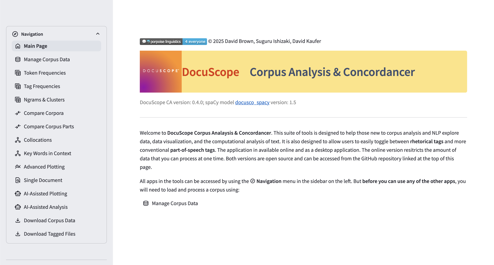
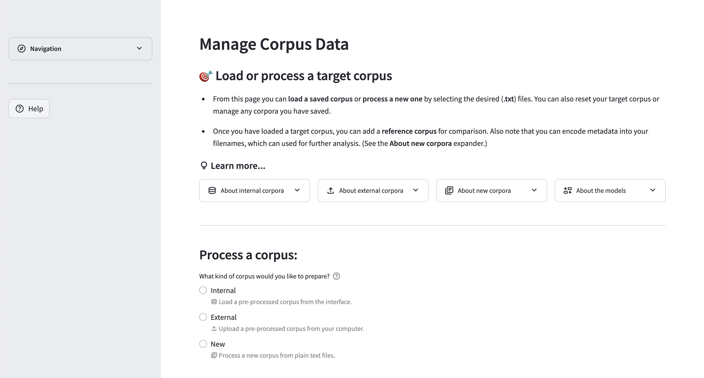
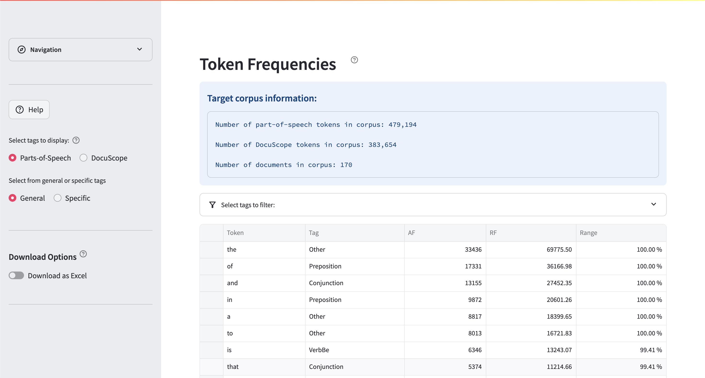
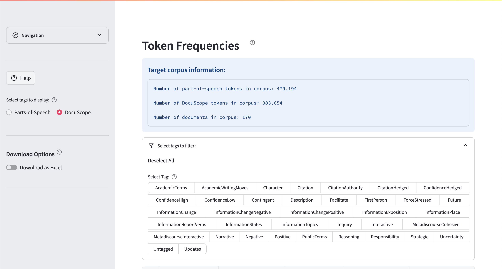

<!-- markdownlint-disable MD025 -->

# Summary

DocuScope Corpus Analysis & Concordancer is a Streamlit application for corpus and rhetorical text analysis. It combines spaCy linguistic annotation with DocuScope rhetorical tagging and runs in either desktop or multi-user modes. A headless API and CLI allow scripted workflows without the web interface.

# Statement of need

Corpus linguistics and computational text analysis are established methods in linguistics, writing studies, and digital humanities [@biber2011corpus; @mcenery2012corpus]. However, existing tools present researchers with a fragmented landscape that forces compromises between accessibility and analytical depth.

Established tools like AntConc [@anthony2005antconc] excel at concordancing, frequency analysis, and keyword identification but provide no part-of-speech or rhetorical annotation capabilities. Web-based platforms like Voyant Tools [@voyant2016] offer accessible text visualization and basic analysis with local installation options, but similarly lack linguistic tagging and rhetorical analysis features. While both tools are excellent for their intended purposes, neither provides the deeper linguistic annotation that modern corpus analysis requires.

Code-centric frameworks (spaCy, NLTK) provide sophisticated linguistic processing but require substantial programming expertise and offer no built-in rhetorical analysis. Proprietary tools often combine features but lack transparency, reproducibility controls, and flexible deployment options.

The DocuScope rhetorical taxonomy [@kaufer2004power] addresses systematic rhetorical analysis, identifying functional language patterns beyond surface-level linguistic features. However, integrating DocuScope with modern NLP pipelines typically requires custom engineering, limiting adoption outside specialized research groups. This barrier is particularly problematic in educational contexts, where students and novice researchers need access to authentic corpus analysis without first mastering programming or command-line interfaces.

No existing tool combines: (1) DocuScope's hierarchical rhetorical tagging, (2) contemporary linguistic annotation (POS, lemmatization), (3) transparent provenance tracking, (4) flexible deployment (desktop, web, headless), (5) reproducible workflows, and (6) educational accessibility in a single package.

DocuScope CA addresses this gap by unifying rhetorical and linguistic analysis in a deployable system that serves both exploratory users (via Streamlit interface) and reproducible workflows (via API/CLI). The intuitive web interface enables students and novices to engage directly with real corpus data, conducting sophisticated analyses without programming prerequisites. Meanwhile, the provenance manifest ensures transparency, and multiple deployment options accommodate diverse institutional and individual needs.

# Contribution and novelty

Key contributions: (1) integrated linguistic + rhetorical tag pipeline; (2) dual desktop / multi-user deployment; (3) explicit provenance manifest (version, model, hashes); (4) compact API and CLI for scripted reuse. These enable accessible, reproducible corpus analysis with rhetorical depth.

# Implementation

Python 3.11 stack: spaCy [@spacy2020] plus a DocuScope extension for joint linguistic/rhetorical tagging; Polars for columnar data processing [@polars2023]; Streamlit for the interface [@streamlit2023]; Plotly for visualization; `docuscospacy` for tag generation. Parsing and metric computation are isolated from presentation so the same core serves both UI and scripted contexts. The API/CLI expose only the minimal surface required for ingestion, parsing, metrics, and export. Tests exercise parsing, session persistence, and analysis routines. To keep reviewers offline, the repository bundles the production DocuScope spaCy models under `webapp/_models/`.

## Ecosystem

DocuScope CA operates within a broader ecosystem designed for textual analysis. The architecture centers on the `docuscospacy` Python package, which extends spaCy with DocuScope rhetorical tagging capabilities. Pre-trained models are distributed via HuggingFace Hub, built from curated training datasets also available on HuggingFace, ensuring transparent model provenance and reproducibility.

This ecosystem supports multiple deployment modes: the web application (this paper), a cross-platform desktop application, and headless API/CLI access. The web application prioritizes educational accessibility and collaborative research, while the desktop version serves individual researchers requiring offline capabilities.

The layered design separates processing logic from interface concerns. Core functions handle corpus ingestion, spaCy+DocuScope parsing, and metric computation, with results cached by content hash to avoid redundant processing.

# Usage and reproducibility

Users may run a hosted instance, local container, desktop build, or the headless API. A sample corpus and script (`paper/scripts/run_example.py`) generate deterministic token annotations, frequency and tag tables, and a manifest (version, model, hashes, counts). Programmatic example:

```python
from docuscope_ca import process_corpus
res = process_corpus('paper/data/test_corpus', metrics=('freq','tags'))
print(res.manifest['corpus']['total_tokens'])
```

Artifacts can be regenerated to validate results.

## Interactive workflow

The typical interactive workflow demonstrates how students and researchers can conduct sophisticated corpus analysis without programming knowledge: (a) select from built-in sample corpora or upload custom text collections; (b) process the corpus through the integrated spaCy+DocuScope pipeline to generate token-level linguistic and rhetorical annotations; (c) process metadata (encoded into file names); (d) explore frequency distributions across tokens, part-of-speech tags, and rhetorical categories; (e) apply filters, create visualizations, and export results for statistical analysis. This workflow supports exploratory discovery and hypothesis-driven research while maintaining provenance tracking.

{#fig:landing width=90%}

{#fig:manage width=90%}

{#fig:freq width=90%}

{#fig:filters width=90%}

## Performance

Benchmark (50 docs; 132k words; Python 3.11.8; 8‑core, 24 GB RAM) achieved ~5.6 documents/s (~890k words/min steady state, ≈1.1 min per million words) excluding initial model load. Contributing factors: batched spaCy calls, vectorized Polars group‑bys, minimal intermediate serialization, and hash‑based avoidance of duplicate work.

# Impact

DocuScope CA supports corpus‑based rhetorical analysis for linguistics, writing studies, and digital humanities. Unlike AntConc [@anthony2005antconc] or exploratory web tools, it combines part-of-speech and rhetorical tagging, modern NLP, and explicit provenance in one deployable system. Optional headless execution and hashing facilitate transparent validation, teaching, and reproducible workflows. The integration of accessible interface, reproducible headless pipeline, and rhetorical annotation addresses a gap between exploratory tools and code‑only stacks.

## Outlook

DocuScope CA represents several years of development as a sole developer project aimed at integrating DocuScope rhetorical tagging within a modern NLP pipeline and making it accessible to diverse user communities. Key technical milestones included migrating processing functions to Polars for performance improvements and transitioning to Streamlit for enhanced usability and deployment flexibility.

Given the educational focus, ongoing development prioritizes expanding user flexibility in creating and editing data visualizations, enabling students and researchers to explore their data through multiple analytical lenses. The broader goal is introducing new methods for modeling and representing textual variation.

The ecosystem approach provides a foundation for sustained development while maintaining accessibility that has been central to the project's mission. Future directions will balance technical sophistication with educational usability, guided by feedback from diverse communities using DocuScope CA in research and teaching contexts.

# Acknowledgements

I acknowledge the DocuScope team at Carnegie Mellon University for the rhetorical framework, the spaCy development team for NLP infrastructure, and the Streamlit team for the web framework.

# References

<!-- References will be automatically generated from paper.bib -->
